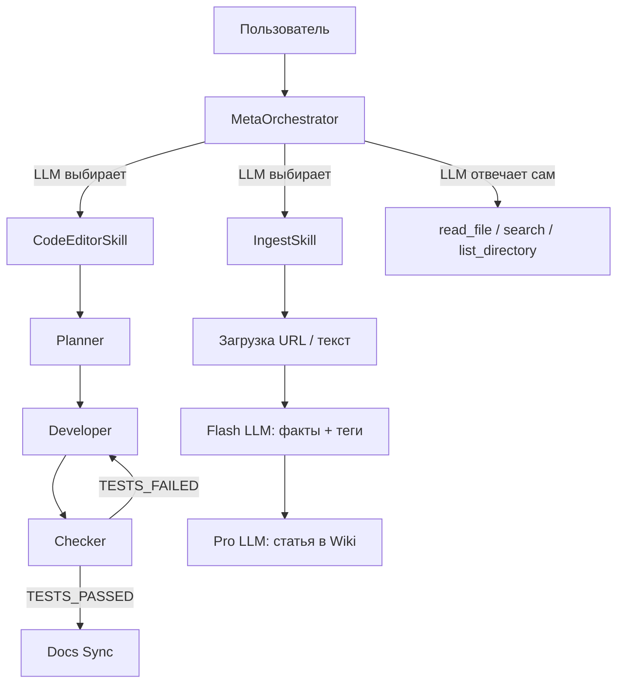

# Архитектура проекта ("Второй мозг")

[⬅ Назад к Индексу](INDEX.md)

## Концепция LLM-Wiki
Вместо классического RAG с векторными базами данных, знания компилируются заранее.
ИИ-агент (Telegram-бот) читает информацию и обновляет структурированные Markdown-документы.

## Технологический Стек
1. **Интерфейс**: Telegram Bot API, библиотека `aiogram` (v3.29+). Асинхронная обработка сообщений.
2. **Оркестрация**: `LangGraph`. Единственный узел `meta_orchestrator` с ReAct-циклом, который через LLM выбирает и вызывает зарегистрированные скиллы.
3. **LLM-провайдеры** — двухуровневая схема с отказоустойчивостью:
   - **Основной — opencode CLI** (`opencode/deepseek-v4-flash-free`, бесплатный DeepSeek V4 Flash). Вызывается через `asyncio.create_subprocess_exec` с флагом `--format json`, вывод парсится как JSONL-поток событий.
   - **Резервный — router_ai** (`https://routerai.ru/api/v1`, OpenAI-совместимый API, модель `deepseek/deepseek-v4-flash`). Используется автоматически при недоступности opencode CLI, а также для всех вызовов с tool-calling (ReAct-цикл), т.к. opencode через subprocess не поддерживает итеративный вызов инструментов.
   - Логика отказоустойчивости реализована в классе `UnifiedLLM` (`src/agent/llm_router.py`).
4. **Хранилище**:
   - `raw/` — файловая система для сырых дампов (вместо БД). Каталог создаётся автоматически при импорте модуля.
   - `wiki/` — файловая система для Markdown-графа знаний. Каталог создаётся автоматически при импорте модуля.
   - `SQLite/PostgreSQL` — для хранения состояния (Checkpointers) LangGraph.

## Поток данных (Data Flow)
1. Пользователь присылает ссылку/текст/команду в Telegram.
2. `aiogram` хендлер перехватывает сообщение, валидирует `ALLOWED_TELEGRAM_ID` и инициирует LangGraph задачу.
3. LangGraph запускает единственный узел `meta_orchestrator`:
   - **MetaOrchestrator** (`src/agent/meta_orchestrator.py`) — LLM-агент с ReAct-циклом
   - Видит все зарегистрированные скиллы как инструменты (code_editor, ingest и др.)
   - Видит read-only инструменты (read_file, search_content, list_directory)
   - Имеет контекст: профиль пользователя, Wiki-каталог, заметки
   - **Сам принимает решение**, какой инструмент вызвать, без классификатора
4. **Если выбран скилл code_editor**:
   - Исполняется `CodeEditorSkill` из `src/agent/skills/code_editor.py`
   - **Orchestrator** координирует цикл: Planner → Developer → Checker
   - **Planner**: изучает задачу, составляет план, сохраняет в `sessions/{id}/plan.md`
   - **Developer**: следует плану, вносит правки в код через tools
   - **Checker**: пишет тесты, тестирует код. Если тесты упали — цикл повторяется
   - После успеха — Docs Sync (актуализация документации)
   - Генерируется финальный отчёт
5. **Если выбран скилл ingest**:
   - Исполняется `IngestSkill` из `src/agent/skills/ingest.py`
   - Загружает контент по URL (или использует текст напрямую)
   - Сохраняет оригинал в `raw/`
   - Flash LLM извлекает факты + теги
   - Pro LLM компилирует Markdown-статью, сохраняет в `wiki/`
   - Регистрирует в `schema/index.json` с перекрёстными ссылками
6. **Если ни один скилл не выбран** (вопрос, разговор):
   - MetaOrchestrator отвечает напрямую, используя read-only инструменты
   - Контекст: Wiki-каталог, заметки о пользователе, профиль
7. Пользователь уведомляется финальным ответом.

## Асинхронность и провайдеры LLM
Весь стек ввода-вывода переведён в `async` в соответствии с `AGENT_RULES.md`:
- Узлы графа — `async def`, LLM вызываются через `await llm.ainvoke(...)`.
- **opencode CLI** вызывается через `asyncio.create_subprocess_shell` с таймаутом 120с. Путь к бинарнику — через `OPENCODE_BIN` env var (для VPS/Ubuntu).
- **router_ai** (OpenAI-совместимый) — через `langchain_openai.ChatOpenAI` с `await llm.ainvoke(...)`.
- Загрузка URL — `aiohttp`.
- Выполнение shell-команд в tools — `asyncio.create_subprocess_shell` с таймаутом.
- Веб-поиск (DuckDuckGo) — `asyncio.to_thread`.

## Система скиллов (Skills)

Система скиллов — это плагинная архитектура для расширения возможностей агента.
Каждый скилл — самодостаточный модуль, реализующий протокол `BaseSkill`.
Скиллы автоматически подхватываются `MetaOrchestrator`.

### Протокол BaseSkill

Определён в `src/agent/skills/base.py`:

- **`name: str`** — уникальное имя скилла
- **`description: str`** — описание для MetaOrchestrator (LLM видит его при выборе инструмента)
- **`async execute(task: str, context: SkillContext) -> str`** — точка входа

`SkillContext` содержит:
- `session_id` / `session_dir` — идентификатор сессии
- `progress` — колбэк для отправки прогресса (Telegram)
- `tool_counter` — счётчик использованных инструментов

### MetaOrchestrator

Реализован в `src/agent/meta_orchestrator.py`. Единственный узел графа LangGraph.



MetaOrchestrator работает так:
1. Получает из реестра все зарегистрированные скиллы
2. Оборачивает каждый в `StructuredTool` (name = skill.name, description = skill.description)
3. Добавляет read-only инструменты (read_file, search_content, list_directory)
4. Формирует системный промпт с контекстом (профиль, Wiki, память) и списком скиллов
5. Запускает ReAct-цикл: LLM сам решает, какой инструмент вызвать

Классификатор `analyze_context` и условный роутинг `route_intent` **удалены** —
MetaOrchestrator сам анализирует запрос и выбирает действие.

### CodeEditorSkill

Реализован в `src/agent/skills/code_editor.py`. Инкапсулирует логику
редактирования кода: Planner → Developer → Checker с циклом.
Использует функции `run_planner`, `run_developer`, `run_checker` из `code_loop.py`.

### IngestSkill

Реализован в `src/agent/skills/ingest.py`. Инкапсулирует логику
сохранения знаний: загрузка → извлечение фактов → компиляция статьи.

### Реестр скиллов

Реализован в `src/agent/skills/registry.py`. Функции:
- `register_skill(skill)` — регистрирует скилл
- `get_skill(name)` — получает скилл по имени
- `get_all_skills()` — возвращает все зарегистрированные скиллы

Авторегистрация происходит при импорте пакета `src.agent.skills` (см. `__init__.py`).

### Добавление нового скилла

```python
from src.agent.skills.base import BaseSkill, SkillContext

class MySkill(BaseSkill):
    name = "my_skill"
    description = "Описание для LLM"

    async def execute(self, task: str, context: SkillContext) -> str:
        # логика скилла
        return "результат"

# регистрация (в src/agent/skills/__init__.py)
from src.agent.skills.registry import register_skill
register_skill(MySkill())
```

После регистрации MetaOrchestrator автоматически увидит новый скилл
как доступный инструмент и сможет его вызвать.

### CodeEditorSkill (внутренняя архитектура)

```
CodeEditorSkill.execute
    │
    ├── git snapshot ДО (capture_git_snapshot)
    │
    ▼
  call_planner ──→ plan.md
    │
    ▼
  call_developer ──→ правки в коде (через tools)
    │
    ▼
  call_checker ──→ тесты
    │
    ├── TESTS_PASSED ──→ Docs Sync ──→ финальный отчёт
    │
    └── TESTS_FAILED ──→ обратно к call_developer (цикл)
```

**Актуализация документации (Docs Sync):**
Реализована в `src/agent/docs_sync.py`. Запускается внутри `CodeEditorSkill` после цикла Developer→Checker.
1. Git snapshot ДО задачи сохраняется в начале `execute`.
2. После завершения задачи вычисляется `after \ before` — файлы, изменённые задачей.
3. Если есть изменённые `.py` файлы → LLM анализирует их и обновляет релевантную документацию.
4. Защита от рекурсии: `.md`-файлы, изменённые sync-функцией, не триггерят повторный sync.

**Правила безопасности:**
- Прямое редактирование кода разрешено **только внутри** `CodeEditorSkill`.
- MetaOrchestrator имеет только read-only инструменты для Q&A.
- Любые правки кода идут исключительно через скилл `code_editor`.

## Ключевые сценарии использования (Use Cases)

1. **Профилирование знаний пользователя (Knowledge Map)**
   - Агент отслеживает компетенции пользователя (например, в сфере агентной разработки) в специализированном файле (например, `wiki/user_knowledge_map.md`).
   - При первом запуске или по запросу агент проводит опрос для выявления пробелов в знаниях.

2. **Ингрессия новых знаний (Document & Research Ingestion)**
   - Пользователь отправляет ссылки на научные статьи, исследования или документацию.
   - Агент сохраняет оригиналы в `raw/`, анализирует их с учетом текущей карты знаний пользователя и формирует выжимки в `wiki/`.

3. **Интерактивное обучение и Q&A (Mentoring)**
   - Пользователь задает уточняющие вопросы по новым знаниям.
   - Агент опирается на свою `wiki/` (и контекст того, что пользователь уже знает), чтобы давать персонализированные ответы, помогая углублять компетенции.
