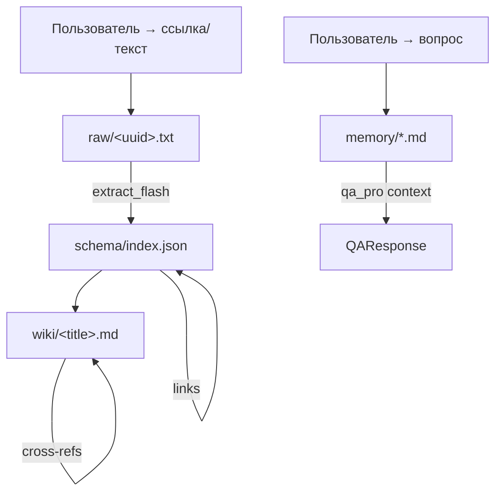

# Схема хранения данных (Data Schema)

[⬅ Назад к Индексу](INDEX.md) | [Перейти к Архитектуре](ARCHITECTURE.md)

Полное описание структуры хранилища «Второго мозга». Документ для coding-агентов: по нему нужно ориентироваться, где что лежит и как связано.

## Обзор хранилища



Проект использует **файловое хранилище** (без БД) с четырьмя каталогами:

| Каталог | Назначение | Создание | Git-tracked |
|---------|-----------|----------|-------------|
| `raw/` | Оригиналы входящих статей (текст, выгрузки) | При каждом ingest | Нет (только `.gitkeep`) |
| `wiki/` | Обработанные статьи (выжимки, Mermaid-схемы) | При каждом ingest | Нет (только `.gitkeep` + `user_knowledge_map.md`) |
| `schema/` | Индекс сопоставления raw↔wiki + перекрёстные ссылки | При первом ingest | Да (`index.json` в `.gitignore`) |
| `memory/` | Личное хранилище пользователя («копия пользователя») | При первом Q&A | Нет (только seed-файлы) |

Все каталоги создаются автоматически при импорте `src/agent/utils.py` (`os.makedirs(..., exist_ok=True)`). На VPS данные переживают перезапуск сервиса.

---

## 1. `raw/` — сырые оригиналы

- **Формат**: `.txt` файлы в UTF-8.
- **Именование**: `{uuid4.hex}.txt` — уникальное имя, не зависит от содержания.
- **Содержимое**: оригинальный текст статьи/страницы (после trafilatura-экстракции, если URL) или текст, присланный пользователем.
- **Связь с wiki**: через `schema/index.json` (поле `raw_file`).
- **Удаление**: только вручную; при удалении нужно также удалить запись из `schema/index.json`.

---

## 2. `wiki/` — структурированные знания

- **Формат**: `.md` файлы в UTF-8.
- **Именование**: `{safe_title}_{uuid8}.md` — человекочитаемый заголовок + uuid-суффикс против коллизий.
- **Структура статьи**:
  1. **Business Summary** — короткая выжимка (польза, стоимость, use-case).
  2. **Technical Architecture** — детали, Mermaid-диаграммы.
  3. **Связанные материалы** — секция с перекрёстными ссылками на родственные статьи (добавляется автоматически).
- **Особый файл**: `wiki/user_knowledge_map.md` — профиль компетенций пользователя (не статья, а справочник того, что пользователь уже знает).

---

## 3. `schema/index.json` — индекс сопоставления

Единый JSON-файл, связывающий raw ↔ wiki и хранящий граф перекрёстных ссылок.

### Структура

```json
{
  "version": 1,
  "articles": [
    {
      "id": "art_abc123def456",
      "raw_file": "raw/abc123.txt",
      "wiki_file": "wiki/LangGraph_Routing_xyz.md",
      "title": "LangGraph Routing",
      "source_url": "https://example.com/article",
      "created_at": "2024-07-08T12:00:00+00:00",
      "tags": ["langgraph", "routing", "state"],
      "links": ["art_def456..."],
      "summary": "Краткое описание статьи в одно-два предложения"
    }
  ]
}
```

### Поля записи

| Поле | Тип | Описание |
|------|-----|----------|
| `id` | str | Уникальный ID: `art_{uuid12}` |
| `raw_file` | str | Относительный путь к raw-файлу |
| `wiki_file` | str | Относительный путь к wiki-файлу |
| `title` | str | Заголовок статьи (до 200 символов) |
| `source_url` | str\|null | URL источника или null для введённого текста |
| `created_at` | str | ISO 8601 timestamp (UTC) |
| `tags` | list[str] | 3–7 ключевых слов для кросс-ссылок |
| `links` | list[str] | ID связанных статей (двунаправленные) |
| `summary` | str | Краткое описание (до 300 символов) |

### Перекрёстные ссылки (cross-references)

Алгоритм автоматический (в `schema.add_article`):
1. При добавлении новой статьи её теги сравниваются с тегами всех существующих.
2. Статьи с **пересекающимися тегами** связываются двунаправленно (links обновляются у обеих).
3. В wiki-файл статьи дописывается секция `## Связанные материалы` со ссылками на родственные статьи.

### Менеджер схемы: `src/agent/schema.py`

| Функция | Назначение |
|----------|-----------|
| `load_index()` → dict | Загружает index.json (с fallback при ошибке) |
| `save_index(index)` | Атомарная запись (через temp-файл + `os.replace`) |
| `add_article(...)` → str | Добавляет статью, вычисляет перекрёстные ссылки, возвращает ID |
| `find_related(tags, limit)` → list | Находит статьи с пересекающимися тегами |
| `get_article_by_wiki(path)` → dict\|None | Поиск записи по wiki-файлу |
| `get_article_by_raw(path)` → dict\|None | Поиск записи по raw-файлу |

---

## 4. `memory/` — личное хранилище пользователя

«Копия пользователя»: всё, что пользователь хочет, чтобы агент помнил о нём и о мире. Читается в `qa_pro_node` и подаётся в системный промпт.

### Категории (файлы)

| Файл | Категория | Что хранится |
|------|-----------|-------------|
| `memory/facts.md` | facts | Факты о мире, концепции, знания |
| `memory/preferences.md` | preferences | Вкусы, привычки, стиль работы |
| `memory/people.md` | people | Коллеги, друзья, менторы, контакты |
| `memory/projects.md` | projects | Текущие/прошлые/планируемые проекты |

### Запись

- `update_memory(category, content)` в `src/agent/utils.py` — дописывает в соответствующий файл.
- Категоризация выполняется LLM в `update_memory_node`: анализирует сообщение пользователя и определяет, в какой файл сохранить (facts/preferences/people/projects или ничего).
- Fallback: нераспознанные категории сохраняются в `facts.md`.

### Чтение

- `read_all_memory()` в `src/agent/utils.py` — читает все файлы и склеивает в единый контекст.
- Ограничение размера: нет (память должна быть полной). Если вырастет — нужно добавить ограничение, как в `read_all_wiki`.

---

## 5. `.gitignore` и данные

В `.gitignore` нужно добавить:

```
raw/*.txt
wiki/Article_*.md
schema/index.json
memory/*.md
```

Что **остаётся** в git: seed-файлы memory (заголовки), `wiki/user_knowledge_map.md`, `.gitkeep`.

---

## 6. Жизненный цикл данных

### Ingest (новая статья)
1. Пользователь присылает URL/текст → `save_raw_node` сохраняет в `raw/{uuid}.txt`.
2. `extract_flash_node` извлекает факты + теги (JSON: `{summary, tags}`).
3. `compile_pro_node`:
   - Ищет связанные статьи в `schema/index.json` по тегам.
   - Генерирует wiki-статью через LLM Pro.
   - Сохраняет в `wiki/{title}_{uuid8}.md`.
   - Добавляет запись в `schema/index.json` (с перекрёстными ссылками).
   - Дописывает секцию «Связанные материалы» в wiki-файл.

### Q&A (вопрос/команда)
1. Пользователь присылает вопрос → `update_memory_node` извлекает личные данные и категоризует в `memory/`.
2. `qa_pro_node` читает `memory/` (личные данные) + `wiki/` (статьи) + профиль и отвечает.

---

## 7. Соответствие кода и хранилища

| Компонент кода | Файл | За что отвечает |
|----------------|------|-----------------|
| `src/agent/schema.py` | менеджер схемы | CRUD для `schema/index.json`, перекрёстные ссылки |
| `src/agent/utils.py` | утилиты хранилища | Пути, чтение/запись raw/wiki/memory |
| `src/agent/graph.py` | LangGraph граф | Оркестрация ingest и Q&A с записью в хранилища |
| `src/agent/llm_router.py` | LLM-провайдеры | opencode CLI (основной) + router_ai (fallback) |
| `src/agent/tools.py` | инструменты агента | bash, read/write/list files |
| `src/agent/security.py` | безопасность | Проверка bash-команд |

---

[⬅ Назад к Индексу](INDEX.md)
