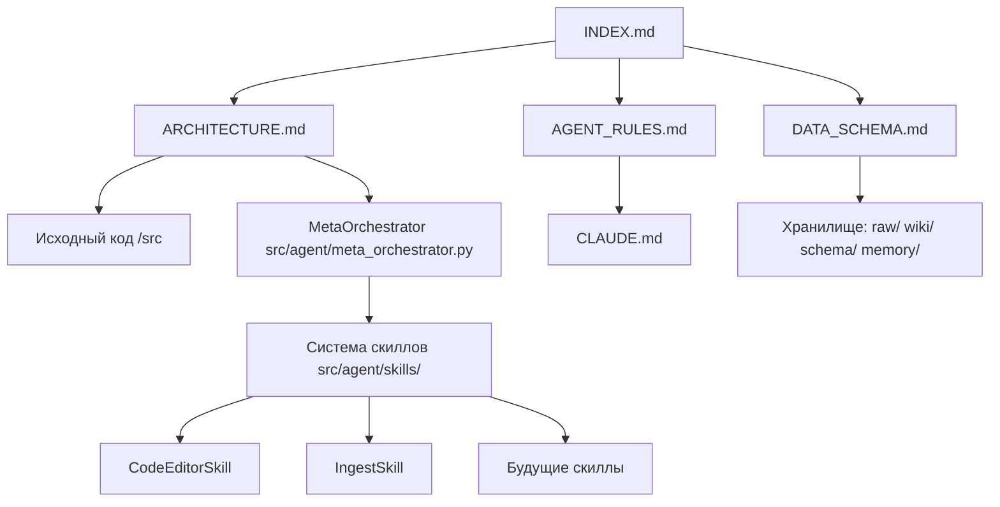

# Индексный файл (Граф знаний проекта)

Добро пожаловать в документацию проекта **«Второй мозг» (ИИ-Агент)**. 
Этот документ служит точкой входа (Root node) в граф документации.

## Граф связей проекта

## Основные разделы
- [Архитектура (ARCHITECTURE.md)](ARCHITECTURE.md) — Описание стека (aiogram, LangGraph, opencode/router_ai) и потока данных.
- [Схема данных (DATA_SCHEMA.md)](DATA_SCHEMA.md) — Структура хранилища: raw/, wiki/, schema/index.json, memory/. Описание перекрёстных ссылок.
- [Правила разработки (AGENT_RULES.md)](AGENT_RULES.md) — Дополнительные правила для агентов при написании кода.
- [CLAUDE.md](../../CLAUDE.md) — Корневые жесткие правила системы (Writeback is Mandatory).

## Пользовательские директории
- `raw/` — оригиналы входящих статей (текст после trafilatura-экстракции).
- `wiki/` — структурированные знания (выжимки статей, Mermaid-схемы).
  - [Карта знаний пользователя (User Knowledge Map)](../../wiki/user_knowledge_map.md) — профиль компетенций для персонализации.
- `schema/index.json` — индекс сопоставления raw↔wiki + перекрёстные ссылки между статьями.
- `memory/` — личное хранилище пользователя («копия пользователя»): факты, предпочтения, люди, проекты.
